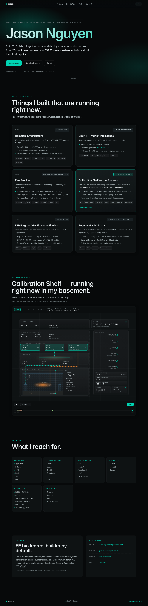

# portfolio

Live at **https://jason.pancake3d.com**. Bun web server plus a small
shelf-event-logger sidecar, behind Traefik on a self-hosted LXC.



The SCADA-style diagram in the middle isn't a canned animation — it
renders live state from a Home Assistant instance running on a basement
aquaponics rig: heater wattage, pump on/off, grow light brightness,
tank temperatures, TDS. Page accent color tracks flag severity (teal =
healthy, amber = warn, red = critical). The timeline below scrubs
through the last 30 days of snapshot data; markers are real flag
transitions — `tank_band_breach`, `basement_cold_drift`,
`tds_out_of_range`, sensor staleness, etc.

## Architecture

- `server.ts` — Bun HTTP server. Polls HA every 30 s for the live
  cache, reads snapshot history from SQLite (read-only).
- `logger/logger.ts` — separate process. Polls HA every 5 min, writes
  a snapshot row, diffs against the previous snapshot to record
  `flag_appeared` / `flag_cleared` events.
- `flags.ts` — shared evaluator. Tank-band breach, stratification,
  TDS out-of-range, heater overdraw, basement cold drift, sensor
  staleness.
- `public/scada.js` — the SVG diagram + live bindings. No framework.
- `public/styles.css` — CSS custom properties drive the ambient color
  cascade through the name gradient, accent dots, button fills.

One Docker image; both services in `docker-compose.yml.example` run
from it with different `command:` entries. Logger writes to
`/app/data/shelf-events.db`, web reads it via a shared volume.

## Run locally

```sh
cp .env.example .env       # edit HA_URL + HA_TOKEN
bun run server.ts
```

The snapshot DB is optional — without it the live view still works,
just no timeline scrub.

## Stack

Bun · TypeScript · `bun:sqlite` · plain SVG + Canvas2D · Docker ·
Traefik (DNS-01 wildcard via Cloudflare). No frameworks, no build step.
